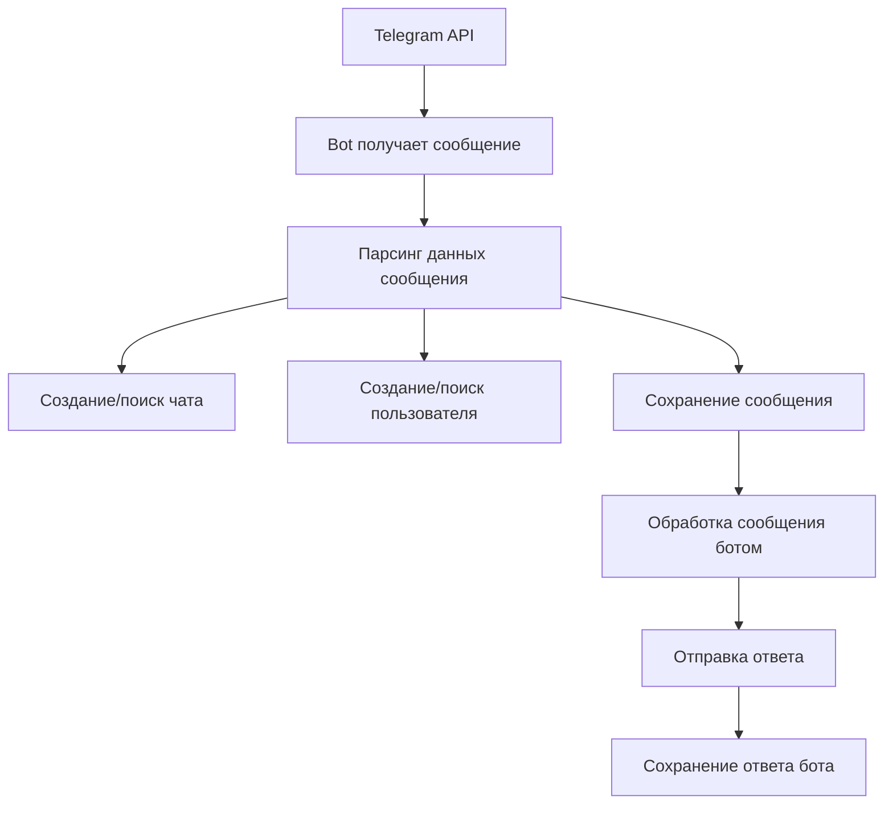

# Поток данных в Telegram боте

## 🔄 Как заполняются таблицы

### 1. **Получение сообщения**



### 2. **Детальный процесс заполнения**

#### **Шаг 1: Создание/поиск чата**
```python
# Вызывается из: src/bots/base_bot.py
chat = db_manager.get_or_create_chat(
    session=session,
    telegram_id=message.chat_id,
    username=message.chat.username,
    title=message.chat.title,
    chat_type=message.chat.type
)
```

**Результат:** Запись в таблице `chats`

#### **Шаг 2: Создание/поиск пользователя**
```python
# Вызывается из: src/bots/base_bot.py
user = db_manager.get_or_create_user(
    session=session,
    telegram_id=message.sender_id,
    username=message.sender.username,
    first_name=message.sender.first_name,
    last_name=message.sender.last_name,
    is_bot=message.sender.bot
)
```

**Результат:** Запись в таблице `users`

#### **Шаг 3: Сохранение сообщения**
```python
# Вызывается из: src/bots/base_bot.py
message_obj = db_manager.save_message(
    session=session,
    telegram_id=message.id,
    chat_id=chat.id,
    user_id=user.id,
    text=message.text,
    message_type='text',
    is_bot_response=False,
    raw_data=message.to_dict()
)
```

**Результат:** Запись в таблице `messages`

#### **Шаг 4: Обработка и ответ**
```python
# Вызывается из: src/bots/simple_responder.py или smart_responder.py
response_text = bot.process_message(message.text)
bot.send_message(chat_id, response_text)
```

#### **Шаг 5: Сохранение ответа бота**
```python
# Вызывается из: src/bots/base_bot.py
response = db_manager.save_bot_response(
    session=session,
    original_message_id=message_obj.id,
    response_text=response_text,
    response_type='auto',
    trigger_keyword=detected_keyword,
    response_time_ms=response_time,
    is_successful=True
)
```

**Результат:** Запись в таблице `bot_responses`

### 3. **Управление сессиями**

#### **Запуск бота**
```python
# Вызывается из: src/bots/base_bot.py при старте
session = BotSession(
    bot_name='simple_responder',
    chat_id=chat.id,
    session_start=datetime.utcnow(),
    is_active=True
)
```

#### **Остановка бота**
```python
# Вызывается из: src/bots/base_bot.py при остановке
session.session_end = datetime.utcnow()
session.is_active = False
```

**Результат:** Запись в таблице `bot_sessions`

### 4. **Статистика**

#### **Ежедневная статистика**
```python
# Вызывается по расписанию или вручную
stats = db_manager.get_chat_stats(session, chat_id, days=1)
```

**Результат:** Запись в таблице `bot_stats`

## 📊 Примеры заполнения

### **Пример 1: Первое сообщение в чате**

**Входящее сообщение:** "Привет!"

**Результат в БД:**

```sql
-- Таблица chats
INSERT INTO chats (telegram_id, username, title, chat_type) 
VALUES (-1001234567890, 'my_channel', 'Мой канал', 'channel');

-- Таблица users  
INSERT INTO users (telegram_id, username, first_name) 
VALUES (123456789, 'john_doe', 'John');

-- Таблица messages
INSERT INTO messages (telegram_id, chat_id, user_id, text, is_bot_response) 
VALUES (12345, 1, 1, 'Привет!', false);

-- Таблица bot_responses
INSERT INTO bot_responses (original_message_id, response_text, response_type, trigger_keyword, response_time_ms) 
VALUES (1, '👋 Привет! Я бот-помощник!', 'auto', 'привет', 150);
```

### **Пример 2: Сессия бота**

**При запуске бота:**

```sql
-- Таблица bot_sessions
INSERT INTO bot_sessions (bot_name, chat_id, session_start, is_active) 
VALUES ('simple_responder', 1, '2025-09-13 15:00:00', true);
```

**При остановке бота:**

```sql
-- Обновление bot_sessions
UPDATE bot_sessions 
SET session_end = '2025-09-13 18:00:00', 
    is_active = false,
    messages_processed = 25,
    responses_sent = 20,
    errors_count = 0
WHERE id = 1;
```

## 🔍 Мониторинг заполнения

### **Проверка активности**
```sql
-- Количество сообщений за последний час
SELECT COUNT(*) FROM messages 
WHERE created_at >= NOW() - INTERVAL '1 hour';

-- Активные сессии
SELECT * FROM bot_sessions 
WHERE is_active = true;

-- Последние ответы бота
SELECT * FROM bot_responses 
ORDER BY created_at DESC 
LIMIT 10;
```

### **Проверка целостности данных**
```sql
-- Сообщения без пользователя
SELECT * FROM messages 
WHERE user_id IS NULL;

-- Ответы без исходного сообщения
SELECT br.* FROM bot_responses br
LEFT JOIN messages m ON br.original_message_id = m.id
WHERE m.id IS NULL;
```

## ⚠️ Важные моменты

1. **Атомарность операций** - все операции выполняются в транзакциях
2. **Обработка ошибок** - при ошибке происходит rollback
3. **Логирование** - все операции логируются
4. **Производительность** - используются индексы для быстрого поиска
5. **Целостность** - внешние ключи обеспечивают связность данных

## 🚀 Оптимизация

### **Индексы**
- `telegram_id` - для быстрого поиска по ID Telegram
- `created_at` - для временных запросов
- `username` - для поиска по username

### **Партиционирование**
- По дате для больших объемов данных
- По chat_id для масштабирования

### **Очистка данных**
```sql
-- Удаление старых сообщений (старше 1 года)
DELETE FROM messages 
WHERE created_at < NOW() - INTERVAL '1 year';

-- Архивирование статистики
INSERT INTO bot_stats_archive 
SELECT * FROM bot_stats 
WHERE date < NOW() - INTERVAL '1 month';
```
